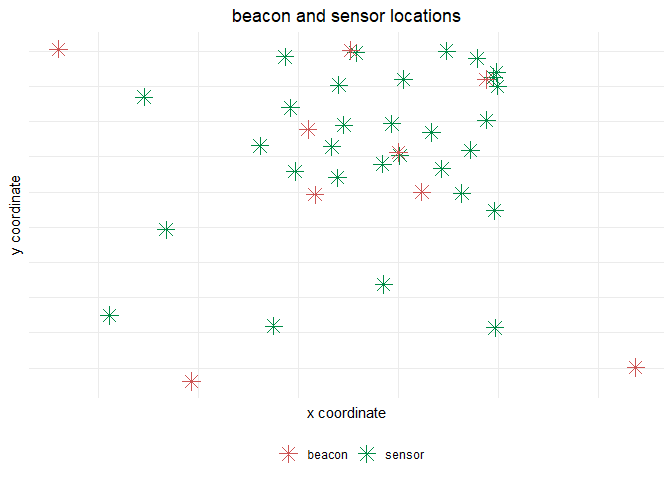

advent of code - day 15
================
chad allison \| 15 december 2022

### loading packages

``` r
library(tidyverse)
library(ivs)
```

### loading input data

``` r
input = data.frame(x = readLines("day15_input.txt"))

head(input)
```

    ##                                                                           x
    ## 1 Sensor at x=2332081, y=2640840: closest beacon is at x=2094728, y=2887414
    ## 2 Sensor at x=3048293, y=3598671: closest beacon is at x=3872908, y=3598272
    ## 3 Sensor at x=2574256, y=3973583: closest beacon is at x=2520711, y=4005929
    ## 4 Sensor at x=3011471, y=2514567: closest beacon is at x=2999559, y=2558817
    ## 5 Sensor at x=3718881, y=2593817: closest beacon is at x=2999559, y=2558817
    ## 6 Sensor at x=2388052, y=2201955: closest beacon is at x=2163809, y=1961540

### formatting input data

``` r
input = input |>
  separate(x, into = c("sensor", "beacon"), sep = ":") |>
  separate(sensor, into = c("sensor_x", "sensor_y"), sep = ",") |>
  separate(beacon, into = c("beacon_x", "beacon_y"), sep = ",") |>
  mutate(sensor_x = as.numeric(str_remove_all(sensor_x, "Sensor at x=")),
         sensor_y = as.numeric(str_remove_all(sensor_y, "y=")),
         beacon_x = as.numeric(str_remove_all(beacon_x, "closest beacon is at x=")),
         beacon_y = as.numeric(str_remove_all(beacon_y, "y=")),
         dist = abs(sensor_x - beacon_x) + abs(sensor_y - beacon_y))

head(input)
```

    ##   sensor_x sensor_y beacon_x beacon_y   dist
    ## 1  2332081  2640840  2094728  2887414 483927
    ## 2  3048293  3598671  3872908  3598272 825014
    ## 3  2574256  3973583  2520711  4005929  85891
    ## 4  3011471  2514567  2999559  2558817  56162
    ## 5  3718881  2593817  2999559  2558817 754322
    ## 6  2388052  2201955  2163809  1961540 464658

### visualising input data

``` r
input |>
  transmute(sensor = paste0(sensor_x, ", ", sensor_y),
            beacon = paste0(beacon_x, ", ", beacon_y)) |>
  pivot_longer(everything(), names_to = "type", values_to = "coord") |>
  separate(coord, into = c("x", "y"), sep = ", ", convert = T) |>
  ggplot(aes(x, y)) +
  geom_point(aes(col = type), size = 4, shape = 8) +
  scale_color_manual(values = c("indianred3", "springgreen4")) +
  theme_minimal() +
  labs(title = "beacon and sensor locations", col = NULL,
       x = "x coordinate", y = "y coordinate") +
  theme(plot.title = element_text(hjust = 0.5),
        axis.text = element_blank(),
        legend.position = "bottom")
```

<!-- -->

### part 1 solution

``` r
target_y = 2000000

input |>
  mutate(dist_y = abs(sensor_y - target_y)) |>
  mutate(left = if_else(dist - dist_y < 0, NA_real_, sensor_x - (dist - dist_y)),
         right = if_else(dist - dist_y < 0, NA_real_, sensor_x + (dist - dist_y) + 1)) |>
  filter(!is.na(left)) |>
  mutate(target_iv = iv(left, right)) |>
  summarise(union_intervals = iv_groups(target_iv)) |>
  mutate(s = iv_start(union_intervals), e = iv_end(union_intervals)) |>
  mutate(L = e - s - 1) |>
  pull(L)
```

    ## [1] 5461729

### this takes a while to run

``` r
xs = input$sensor_x
ys = input$sensor_y
dist = input$dist
grid_max = 4000000

system.time(
  res <- invisible(lapply(0:grid_max, function(grid_y) {
  if (grid_y %% 10000 == 0) message(Sys.time(), ": ", grid_y)
  dist_y <- abs(ys - grid_y)
  left <- if_else(dist - dist_y < 0, NA_real_, pmax(xs - (dist - dist_y), 0))
  right <- if_else(dist - dist_y < 0, NA_real_, pmin(xs + (dist - dist_y) + 1, grid_max + 1))
  valid <- !is.na(left) & !is.na(right) & left < right
  union_of_intervals <- iv_groups(iv(left[valid], right[valid]))
  if (length(union_of_intervals) == 1) return(NULL)
  distress <- iv_start(iv_complement(union_of_intervals))
  result <- distress * 4000000 + grid_y
  cat("\n\nResult:", result, "\n\n")
  result
  })))
```

### part 2 solution

``` r
# compact(res)[[1]]
print(10621647166538)
```
